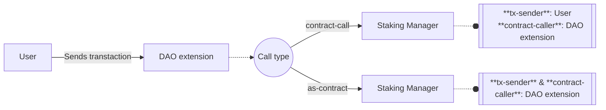
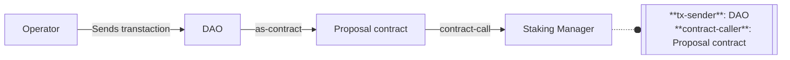

# xlink-staking

- Location: `xlink-dao/contracts/aux/xlink-staking.clar`
<!-- - [Deployed contract](link-to-explorer) -->

The `xlink-staking` contract, also known as the **XLink Staking Manager**, is designed to manage liquid staking pools for multiple tokens and track staker positions within each pool. It holds users' staked funds, while the actual staking execution and reward reinvestment processes are managed off-chain by XLink's infrastructure.

The Staking Manager contract is part of a hybrid, token-agnostic liquid staking management system, that operates alongside off-chain backend and frontend components managed by XLink.

## Liquid staking

The lifecycle of liquid staking pools is based on three main operations:

1. **Staking**. Users deposit tokens into the `xlink-staking` contract, which are staked externally.
2. **Rewards accrual**. Rewards earned through the external staking protocol are periodically restaked, generating automatic compound interest for stakers.
3. **Unstaking**. Users can withdraw their staked tokens, which include accumulated restaked rewards, at any time.

These are the main three features of the `xlink-staking` contract. Each of these has an impact on the contract storage and generates on-chain events, which are listened by the XLink off-chain components to perform actions.

<!-- ### Shares-based staking -->

### Shares representation

The system utilizes **shares** instead of token amounts to represent users' staking positions. Shares provide a fixed representation of the users' proportional ownership of the total amount staked, which intrinsically grows over time due the reinvestment of the staking rewards.

## Reward accrual

The account for the restaked rewards is permissionlessly performed by **updaters**, who submit messages signed by **validators**. This action is performed via the [`add-rewards`](#add-rewards) function.

Validators are XLink protocol actors responsible for maintaining the system's integrity and synchronization. In this sense, they role includes generating a proof each time rewards are successfully collected and restaked in the external protocol.

The proof consists of a signed message indicating the token, the new amount of total accrued rewards and a timestamp. Once upaters collect a sufficient number of proofs, they are in charge of submitting them to the Staking Manager to perform state updates.

Note that this operation does not involve shares management and the key state update is the total staked amount in the [`total-staked`](#total-staked) map. This is the core operation of the liquid staking logic.

## Stake / Unstake

### Authorization

These operations are only available for **governance** roles (guarded by [`is-dao-or-extension`](#is-dao-or-extension) function), what does this imply?

The [`stake`](#stake) and [`unstake`](#unstake) functions are designed to have a DAO extension as `contract-caller`. Otherwise, the `tx-sender` must be the DAO calling through a proposal contract.

This means that a regular user can only access these features through an intermediary contract (façade, endpoint, etc.), which needs to be necessarily an enabled DAO extension. The external call to the `xlink-staking` contract, a.k.a. Staking Manager can be implemented in two different ways, which results in two different authentications for the `tx-sender`, the staker.

Summarizing, the regular use of these operations is by users invoking them via intermediary contracts which need to be DAO extensions. However, this is not the only possibility, as they can also be called by a proposal contract executed by the DAO.

#### End user call

#### Governance call

### Mechanics

In the Staking Manager, the staker is the `tx-sender`. As explained before, depending on the intermediate contract design, the staker may be an end user or the endoint/façade that acts in behalf of the user. So every time we say staker (or `user`, as it is defined within the contract), we are referring to any of these two possibilities.

Upon staking, the shares that respresent the amount to-be-staked are calculated and stored in the [`user-shares`](#user-shares) map. This is the staking position and represents the user's portion of the total amount staked. Then, the amount is transferred from the `tx-sender` to the Staking Manager. Finally, since the total amount staked and total shares increased, this state tracking is updated.

Unstaking performs the exact reverse operations. If first calculates the shares that correspond to the amount willing to unstake. Then, the unstaked amount is transferred from the Staking Manager to the `tx-sender`. Finally, state upates are performed to decrease user shares, total shares and total amount staked.

Note that these two operations involve shares management and mutate the staking state of a certain token in three dimensions: total shares, total amount staked and user share-based staking position.

#### Amount to shares conversion

On each staking and unstaking action, an amount-to-shares conversion is perfomed, which is given by the following equation:

$$ \textrm{Shares} = \frac{\textrm{Amount}}{\textrm{Total Staked}} \; \cdot \; \textrm{Total Shares}.$$

This is how [`get-shares-given-amount`](#get-shares-given-amount) function works. The ratio between the total amount staked and the total shares determines the share price in token units: how many tokens represents one share?

$$ \textrm{Price} = \frac{\textrm{Total Staked}}{\textrm{Total Shares}}$$

Once the staking/unstaking action finishes, these two values are updated in a way that the price remains constant.

## Roles

- **Validators**: Trusted entities responsible for maintaining the system's integrity and synchronization. Within the XLink Staking Manager, are the actors who proof the reward reinvestment on the external staking protocol.
- **Updaters**: Actors resposible for submitting proofs to perform the total staked value update for any token.
- **Governance**: Include DAO and its enabled extensions. These roles are authenticated via the [`is-dao-or-extension`](#is-dao-or-extension) function. The extensions are authenticated as `contract-caller`, while the DAO is authenticated a the `tx-sender` (proposal execution scenario).

## Tokens

Each token within the Staking Manager will have:

- A Stacks principal indicating the token implementation contract, which needs to be approved in the [`approved-tokens`](#approved-tokens) map.
- A total amout staked, tracked by the [`total-staked`](#total-staked) map.
- A total amount of accrued rewards, which are the ones already restaked, tracked by the [`accrued-rewards`](#accrued-rewards) map.
- A total amount of shares issued, tracked by the [`total-shares`](#total-shares) map.
- A register of each staker and their amount of shares, where the sum of all staker shares equal the total shares. This ownership is tracked by the [`user-shares`](#user-shares) map.

## Features

### Main operations

All these operations are privileged and protected by the [`is-dao-or-extension`](#is-dao-or-extension) function, meaning that only governance roles can execture them. However, the [`add-rewards`](#add-rewards) function is more permissive than staking and unstaking actions, as it also allows approved updaters as callers (`tx-sender`).

#### `add-rewards`

Permissionless adds accrued staking rewards to a specific token. The function requires that the message `{ token: principal, accrued-rewards: uint, update-block: uint }` is signed by a sufficient number of approved validators ([`required-validators`](#required-validators)). The message must be proccessed within a certain block range determined by the `update-block` value and [`block-threshold`](#block-threshold); otherwise, the message ir considered too old.

Actions performed:

- Calculates the delta of previous accrued rewards and the new amount given by the `accrued-rewards` value of the message. Mints the delta amount to its own balance (`xlink-staking` contract) to account for the new staked amount.
- Updates the [`accrued-rewards`](#accrued-rewards) map.
- Updates the [`total-staked`](#total-staked) map.
- Emits a log with an `"add-rewards"` notification and a payload with details.

##### Parameters

| Name              | Type                                                                              |
| ----------------- | --------------------------------------------------------------------------------- |
| `message`         | `{ token: principal, accrued-rewards: uint, update-block: uint }`                 |
| `token-trait`     | `<ft-trait>`                                                                      |
| `signature-packs` | `list 100 { signer: principal, message-hash: (buff 32), signature: (buff 65) }))` |

#### `stake`

Stakes a certain amount of a token.

Actions performed:

- Calls `add-rewards` to update the total staked value if necessary. Note this is very important since the `total-staked` value of the token is utilized to calculate the shares given the amount.
- Calculates `shares` that corresponds to the user given the amount to stake.
- Transfers the specified amount from the `tx-sender` (user) to the `xlink-staking` contract.
- Updates the `user-shares` map.
- Updates the `total-shares` map.
- Updates the `total-staked` map.
- Emits a log with a `"stake"` notification and a payload with details including user, token and updated values.

##### Parameters

| Name              | Type                                                                              |
| ----------------- | --------------------------------------------------------------------------------- |
| `token-trait`     | `<ft-trait>`                                                                      |
| `amount`          | `uint`                                                                            |
| `message`         | `{ token: principal, accrued-rewards: uint, update-block: uint }`                 |
| `signature-packs` | `list 100 { signer: principal, message-hash: (buff 32), signature: (buff 65) }))` |

#### `unstake`

Unstakes a certain amount of a token.

Actions performed:

- Calls `add-rewards` to update the total staked value if necessary. Note this is very important since the `total-staked` value of the token is utilized to calculate the shares given the amount.
- Calculates `shares` that corresponds to the user given the amount to unstake.
- Updates the `user-shares` map.
- Updates the `total-shares` map.
- Updates the `total-staked` map.
- Transfers the specified amount from the `tx-sender` (user) to the `xlink-staking` contract.
- Emits a log with a `"stake"` notification and a payload with details including user, token and updated values.

##### Parameters

| Name              | Type                                                                              |
| ----------------- | --------------------------------------------------------------------------------- |
| `token-trait`     | `<ft-trait>`                                                                      |
| `amount`          | `uint`                                                                            |
| `message`         | `{ token: principal, accrued-rewards: uint, update-block: uint }`                 |
| `signature-packs` | `list 100 { signer: principal, message-hash: (buff 32), signature: (buff 65) }))` |

### Governance

The following features are guarded by the [`is-dao-or-extension`](#is-dao-or-extension) function, meaning that their use is resticted to the LISA DAO or enabled extensions.

#### `withdraw`

Withdraws an amount of any approved token and substracts it from the total amount staked. Tokens are transferred to the `tx-sender`.

Actions performed:

- Transfers the specified amount from the `xlink-staking` contract to the `tx-sender`.
- Updates the `total-staked` map.
- Emits a log with a `"withdraw"` notification and a payload with details.

##### Parameters

| Name          | Type         |
| ------------- | ------------ |
| `token-trait` | `<ft-trait>` |
| `amount`      | `uint`       |

#### `set-paused`

Sets the [`is-paused`](#is-paused) variable.

##### Parameters

| Name     | Type   |
| -------- | ------ |
| `paused` | `bool` |

#### `set-approved-token`

Sets the approval status of a token within the Staking Manager. Modifies the [`approved-tokens`](#approved-tokens) map.

##### Parameters

| Name       | Type        |
| ---------- | ----------- |
| `token`    | `principal` |
| `approved` | `bool`      |

#### `set-approved-updater`

Sets the approval status of an updater. Modifies the [`approved-updaters`](#approved-updaters) map.

##### Parameters

| Name       | Type        |
| ---------- | ----------- |
| `updater`  | `principal` |
| `approved` | `bool`      |

#### `set-block-threshold`

Sets the [`block-threshold`](#block-threshold) variable.

##### Parameters

| Name        | Type   |
| ----------- | ------ |
| `threshold` | `uint` |

#### `set-accrued-rewards`

Permissionlessly sets the accrued rewards value of a certain `token` key in the [`accrued-rewards`](#accrued-rewards) map. Note this function potentially overwrites the value updatead via the [`add-rewards`](#add-rewards) function.

##### Parameters

| Name      | Type                                   |
| --------- | -------------------------------------- |
| `token`   | `principal`                            |
| `details` | `{ amount: uint, update-block: uint }` |

#### `set-required-validators`

Sets the [`set-required-validators`](#required-validators) variable.

##### Parameters

| Name       | Type   |
| ---------- | ------ |
| `required` | `uint` |

#### `add-validator`

Adds a new `validator` key in the [`validators-registry`](#validators-registry) map. Values cannot be modified if the key already exists, since the the update is performed with the [`map-insert`](https://docs.stacks.co/reference/functions#map-insert) Clarity function.

##### Parameters

| Name        | Type                                      |
| ----------- | ----------------------------------------- |
| `validator` | `principal`                               |
| `details`   | `{ token: principal, pubkey: (buff 33) }` |

#### `remove-validator`

Removes an entry in the [`validators-registry`](#validators-registry) map, using the [`map-delete`](https://docs.stacks.co/reference/functions#map-delete) Clarity function.

##### Parameters

| Name        | Type        |
| ----------- | ----------- |
| `validator` | `principal` |

### Supporting features

#### `is-dao-or-extension`

Standard protocol function to check whether the `contract-caller` is an enabled extension within the DAO or the `tx-sender` is the DAO itself (proposal execution scenario). The enabled extension check is delegated to the LISA's `executor-dao` contract.

#### Staking validation

- `validate-stake`
- `validate-unstake`

#### Shares conversion

- `get-shares-given-amount`
- `get-amount-given-shares`

#### Message handling

- `message-domain`
- `create-oracle-message`
- `decode-oracle-message`
- `hash-oracle-message`

### Getters

These functions are getters to revieve all the [storage](#storage) variables and values withing each map. For maps, note that for validators it throws if the principal is not a key within `validators-regitry`, while in the token maps they return a default value.

#### Variables

- `get-paused`
- `get-block-threshold`
- `get-required-validators`

#### Maps

- `get-validator-or-fail`
- `get-approved-token-or-default`
- `get-shares-or-default`
- `get-total-shares-or-default`
- `get-total-staked-or-default`
- `get-accrued-rewards-or-default`
- `get-approved-updater-or-default`

## Storage

### `is-paused`

| Data     | Type   |
| -------- | ------ |
| Variable | `bool` |

Indicates the operational status of the main contract operations: [`add-rewards`](#add-rewards), [`stake`](#stake) and [`unstake`](#unstake).

### `approved-tokens`

| Data | Type             |
| ---- | ---------------- |
| Map  | `principal bool` |

Maintains a mapping of token contracts (`principal`) to their approval status (`bool`) within the Staking Manager.

### `user-shares`

| Data | Type                                         |
| ---- | -------------------------------------------- |
| Map  | `{ user: principal, token: principal } uint` |

Tracks the number of shares held by each staker (`user`) for a specific `token`.

### `total-staked`

| Data | Type             |
| ---- | ---------------- |
| Map  | `principal uint` |

Tracks the total value staked for each token contract (`principal`).

### `total-shares`

| Data | Type             |
| ---- | ---------------- |
| Map  | `principal uint` |

Tracks the total shares issued for each staking token (`principal`).

### `validators-registry`

| Data | Type                                                |
| ---- | --------------------------------------------------- |
| Map  | `principal { token: principal, pubkey: (buff 33) }` |

Maintains a mapping of the registered validators. Each one is identified by a Stacks `principal` and has associated `token` and public key used for message signature verification.

### `required-validators`

| Data     | Type   |
| -------- | ------ |
| Variable | `uint` |

Indicates the minimum number of validators required to sign a message for it to be considered valid.

### `accrued-rewards`

| Data | Type                                             |
| ---- | ------------------------------------------------ |
| Map  | `principal { amount: uint, update-block: uint }` |

Tracks the total rewards that have been collected and restaked for each token, identified by its contract `principal`. The `update-block` field records the [`stacks-block-height`](https://docs.stacks.co/reference/keywords#stacks-block-height) of the last update. This map plays a key role in the [`add-rewards`](#add-rewards) function mechanism.

### `block-threshold`

| Data     | Type   |
| -------- | ------ |
| Variable | `uint` |

Specifies the number of Stacks blocks allowed as a delay for submitting an [`add-rewards`](#add-rewards) message.

### `approved-updaters`

| Data | Type             |
| ---- | ---------------- |
| Map  | `principal bool` |

Maps updaters (`principal`) to their approval status (`bool`).

### Relevant constants

#### `ONE_8`

| Type   | Value        |
| ------ | ------------ |
| `uint` | `u100000000` |

Mathematical constant used to restrict the decimal precision to 8 digits.

#### `MAX_REQUIRED_VALIDATORS`

| Type   | Value |
| ------ | ----- |
| `uint` | `u20` |

Defines the upper bound for the [`required-validators`](#required-validators) variable.

## Contract calls

<!-- Describe calls to other contracts with bullet points. Why, in which cases, is this interaction (call) utilized within the contact? -->

- `<ft-trait>`: Interaction with any approved token to perform mint actions ([`add-rewards`](#add-rewards)) and transfers (mostly within [`stake`](#stake) and [`unstake`](#unstake), but also within the [`withdraw`](#withdraw) governance function). The `ft-trait` within the contract is the custom SIP-010 implementation for handling fixed notation, available at `'SP2XD7417HGPRTREMKF748VNEQPDRR0RMANB7X1NK.trait-sip-010`.

- `'SP2XD7417HGPRTREMKF748VNEQPDRR0RMANB7X1NK.executor-dao`: This contract is exclusively called by the [`is-dao-or-extension`](#is-dao-or-extension) function for authorizing governance operations.

## Errors

| Error Name                         | Value         |
| ---------------------------------- | ------------- |
| `err-not-authorised`               | `(err u1000)` |
| `err-paused`                       | `(err u1001)` |
| `err-unknownvalidator`             | `(err u1006)` |
| `err-validator-already-registered` | `(err u1008)` |
| `err-hash-mismatch`                | `(err u1010)` |
| `err-invalid-signature`            | `(err u1011)` |
| `err-message-to-old`               | `(err u1012)` |
| `err-invalid-block`                | `(err u1013)` |
| `err-required-validators`          | `(err u1015)` |
| `err-invalid-validator`            | `(err u1016)` |
| `err-invalid-input`                | `(err u1017)` |
| `err-token-mismatch`               | `(err u1018)` |
| `err-invalid-amount`               | `(err u1019)` |
| `err-update-failed`                | `(err u1020)` |
| `err-duplicated-signatures`        | `(err u1021)` |

<!-- Documentation Contract Template v0.1.1 -->